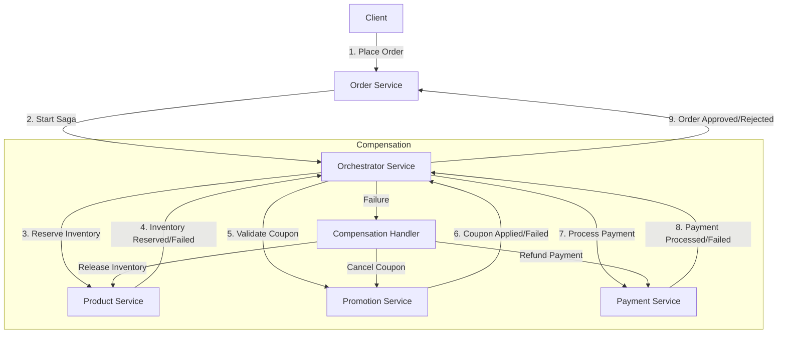
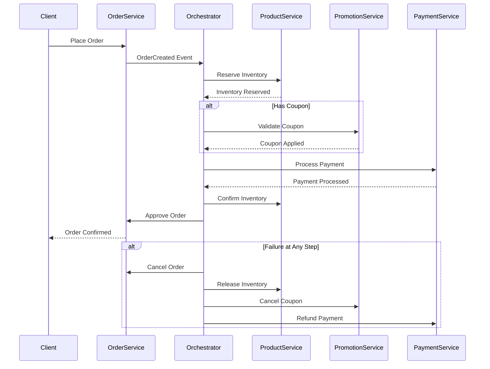

# Orchestrator Service

The Orchestrator Service is a critical component in our microservices architecture, responsible for coordinating complex business transactions that span multiple services using the SAGA pattern. It ensures data consistency across distributed services and provides transaction compensation when failures occur.

## Table of Contents
- [Overview](#overview)
- [SAGA Pattern Implementation](#saga-pattern-implementation)
- [Service Architecture](#service-architecture)
- [Order Processing Flow](#order-processing-flow)
- [Key Components](#key-components)
- [Event Flow and Kafka Topics](#event-flow-and-kafka-topics)
- [Compensation Mechanisms](#compensation-mechanisms)
- [Configuration](#configuration)
- [Deployment](#deployment)

## Overview

The Orchestrator Service acts as a central coordinator for distributed transactions, particularly focusing on order processing workflows. It manages the sequence of steps required to complete an order, including inventory reservation, discount application, payment processing, and order confirmation, with proper compensation actions in case of failures.

### Key Features

- **SAGA Pattern Implementation**: Manages sequences of local transactions with compensation mechanisms
- **Event-Driven Architecture**: Uses Kafka for reliable asynchronous communication
- **Transaction Monitoring**: Tracks the state of each transaction across services
- **Compensation Logic**: Handles rollbacks when failures occur at any step
- **Resilience Patterns**: Implements circuit breakers and retries for service communication

## SAGA Pattern Implementation

The Orchestrator Service implements the SAGA orchestration pattern, where it:

1. Coordinates a sequence of local transactions across multiple services
2. Tracks the state of each step in the workflow
3. Triggers appropriate compensation actions when failures occur
4. Ensures eventual consistency across all participating services



## Service Architecture

The Orchestrator Service interacts with multiple services to complete the order flow:

- **Order Service**: Handles order creation and status management
- **Product Service**: Manages inventory reservation and confirmation
- **Promotion Service**: Validates and applies coupons and discounts
- **Payment Service**: Processes payments and refunds

These interactions occur through a combination of REST APIs (via Feign clients) and asynchronous messaging (via Kafka).

## Order Processing Flow

The standard order processing flow includes:

1. **Order Creation**: The Order Service creates an order and notifies the Orchestrator
2. **Inventory Reservation**: The Orchestrator requests the Product Service to reserve inventory
3. **Discount Application**: If coupons are provided, the Orchestrator validates them with the Promotion Service
4. **Payment Processing**: The Orchestrator requests the Payment Service to process payment
5. **Order Confirmation**: Upon successful payment, the Orchestrator confirms the order
6. **Inventory Update**: The Product Service updates inventory levels
7. **Order Completion**: The Order Service marks the order as completed

### Detailed Flow Diagram



## Key Components

The service consists of several key components:

### SAGA Handlers

- **OrderSagaOrchestrator**: Handles the main order flow saga
- **DiscountSagaHandler**: Manages coupon validation and application
- **SplitPaymentSagaHandler**: Processes orders with multiple payment methods

### Data Models

- **Events**: OrderCreatedEvent, ProductReservedEvent, CouponAppliedEvent, PaymentProcessedEvent, etc.
- **Requests**: ReservationRequest, PaymentRequest, CouponValidationRequest, etc.
- **Responses**: OrderResponse, PaymentResponse, ReservationResponse, etc.

### Persistence

- **ESagaState**: Entity for tracking saga state and progress
- **SagaStateRepository**: For persisting and retrieving saga states

### Messaging

- **KafkaProducer**: Sends events to various Kafka topics
- **KafkaConsumer**: Listens for events from different services

## Event Flow and Kafka Topics

The Orchestrator Service uses the following Kafka topics for event-driven communication:

| Topic | Description | Producer | Consumer |
| ----- | ----------- | -------- | -------- |
| `order-created-events` | Order creation events | Order Service | Orchestrator |
| `product-reserved-events` | Inventory reservation events | Orchestrator/Product | Orchestrator |
| `product-reservation-failed-events` | Inventory reservation failures | Product Service | Orchestrator |
| `payment-processed-events` | Payment completion events | Payment Service | Orchestrator |
| `payment-failed-events` | Payment failure events | Payment Service | Orchestrator |
| `order-approved-events` | Order approval events | Orchestrator | Order Service |
| `order-cancelled-events` | Order cancellation events | Orchestrator | Order Service |
| `coupon-applied-events` | Discount application events | Promotion Service | Orchestrator |
| `split-payment-processed-events` | Split payment events | Payment Service | Orchestrator |

## Compensation Mechanisms

The Orchestrator Service implements the following compensation mechanisms for different failure scenarios:

1. **Inventory Reservation Failure**:
   - Update order status to INVENTORY_ERROR
   - Cancel the order

2. **Coupon Validation Failure**:
   - Continue with original amount or fail based on configuration
   - Log warning or error as appropriate

3. **Payment Failure**:
   - Release reserved inventory
   - Cancel applied coupons
   - Update order status to PAYMENT_FAILED

4. **Order Approval Failure**:
   - Refund payment if already processed
   - Release inventory
   - Cancel applied coupons

Each compensation action is tracked in the saga state to ensure proper cleanup.

## Configuration

The service is configured through `application.yaml` with the following key sections:

- **Server Configuration**: Port, error handling, etc.
- **Eureka Client**: For service discovery
- **Kafka**: Topics, serialization, consumer groups
- **Database**: For saga state persistence
- **Redis**: For caching and temporary state storage
- **Microservices URLs**: Endpoints for other services
- **Saga Settings**: Timeouts, retries, etc.

## Deployment

The Orchestrator Service is containerized using Docker and can be deployed as part of the microservices stack using the provided `docker-compose.yaml` file.

### Requirements

- Java 17+
- PostgreSQL
- Kafka
- Redis (optional)
- Eureka Server (for service discovery)

### Running Locally

```bash
# Build the service
./mvnw clean package

# Run with default configuration
java -jar target/orchestrator-service.jar

# Run with custom configuration
java -jar target/orchestrator-service.jar --spring.config.location=file:./custom-config.yaml
```

### Environment Variables

Key environment variables that can be customized:

- `SERVER_PORT`: HTTP port (default: 8095)
- `SPRING_KAFKA_BOOTSTRAP_SERVERS`: Kafka brokers
- `SPRING_DATASOURCE_URL`: Database URL
- `EUREKA_CLIENT_SERVICE-URL_DEFAULTZONE`: Eureka server URL
