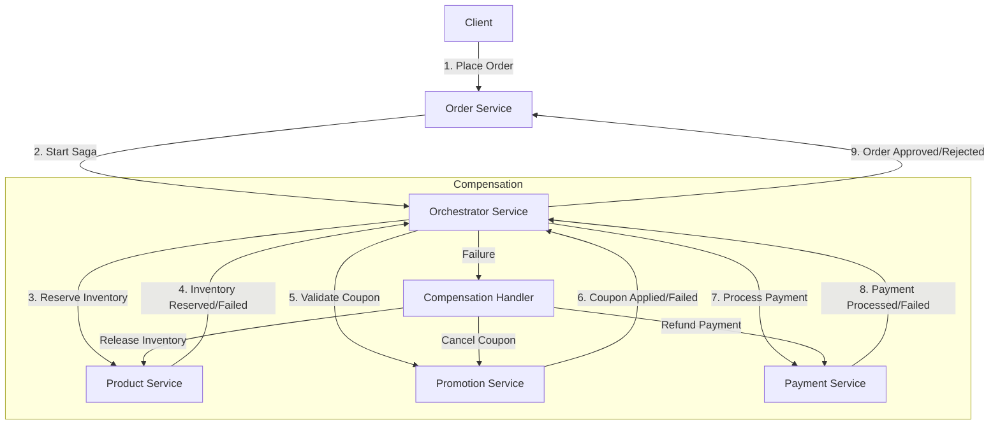
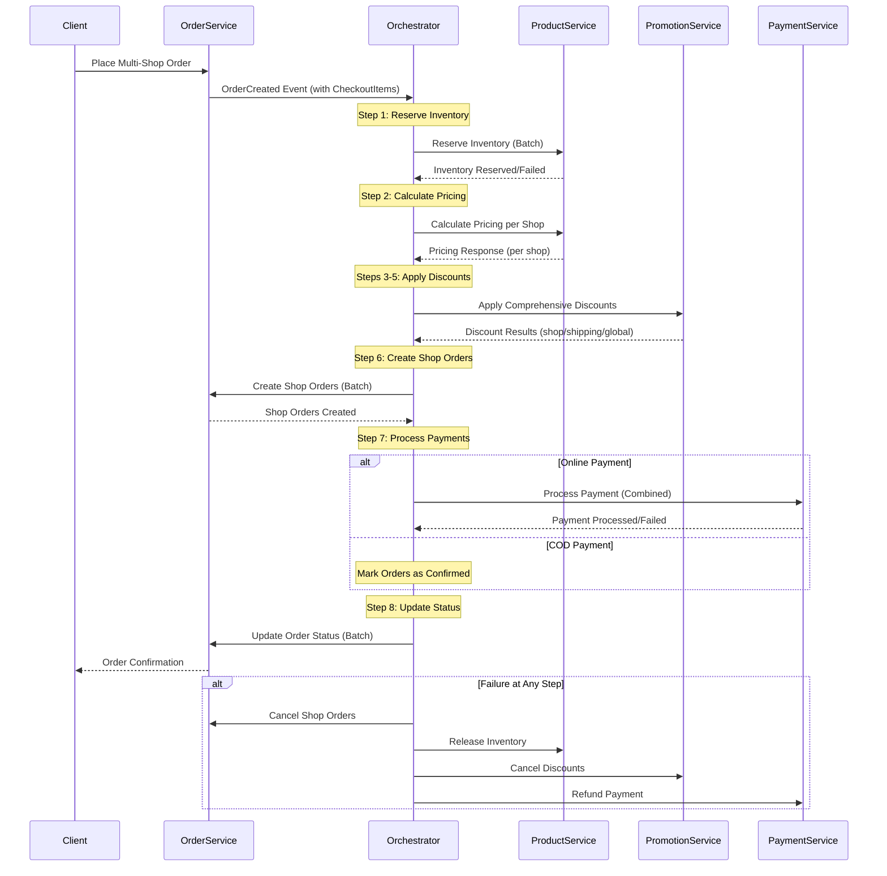
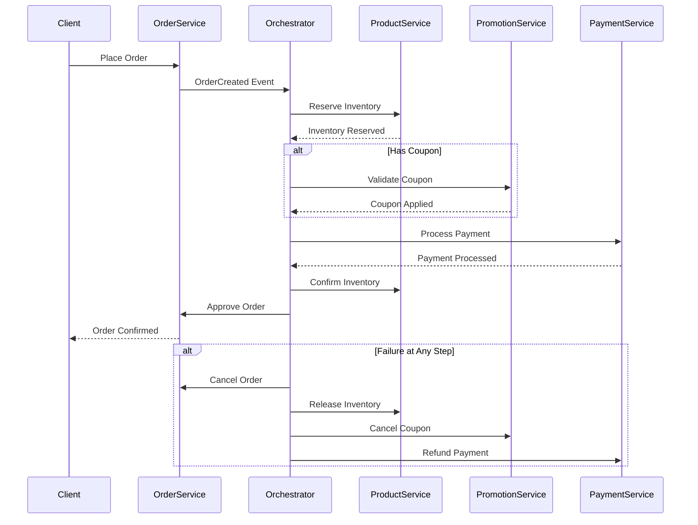

# Orchestrator Service

The Orchestrator Service is a critical component in our microservices architecture, responsible for coordinating complex business transactions that span multiple services using the SAGA pattern. It ensures data consistency across distributed services and provides transaction compensation when failures occur.

## Table of Contents
- [Overview](#overview)
- [SAGA Pattern Implementation](#saga-pattern-implementation)
- [Service Architecture](#service-architecture)
- [Order Processing Flow](#order-processing-flow)
- [Enhanced Multi-Shop Order Flow](#enhanced-multi-shop-order-flow)
- [Key Components](#key-components)
- [Event Flow and Kafka Topics](#event-flow-and-kafka-topics)
- [Compensation Mechanisms](#compensation-mechanisms)
- [Configuration](#configuration)
- [Deployment](#deployment)

## Overview

The Orchestrator Service acts as a central coordinator for distributed transactions, particularly focusing on order processing workflows. It manages the sequence of steps required to complete an order, including inventory reservation, discount application, payment processing, and order confirmation, with proper compensation actions in case of failures.

### Key Features

- **SAGA Pattern Implementation**: Manages sequences of local transactions with compensation mechanisms
- **Event-Driven Architecture**: Uses Kafka for reliable asynchronous communication
- **Multi-Shop Order Processing**: Handles orders spanning multiple shops with separate order creation per shop
- **Comprehensive Discount Management**: Supports shop-level, shipping, and global discounts
- **Transaction Monitoring**: Tracks the state of each transaction across services
- **Compensation Logic**: Handles rollbacks when failures occur at any step
- **Resilience Patterns**: Implements circuit breakers and retries for service communication

## SAGA Pattern Implementation

The Orchestrator Service implements the SAGA orchestration pattern, where it:

1. Coordinates a sequence of local transactions across multiple services
2. Tracks the state of each step in the workflow
3. Triggers appropriate compensation actions when failures occur
4. Ensures eventual consistency across all participating services



## Service Architecture

The Orchestrator Service interacts with multiple services to complete the order flow:

- **Order Service**: Handles order creation and status management
- **Product Service**: Manages inventory reservation, confirmation, and pricing calculations
- **Promotion Service**: Validates and applies coupons and comprehensive discounts
- **Payment Service**: Processes payments and refunds

These interactions occur through a combination of REST APIs (via Feign clients) and asynchronous messaging (via Kafka).

## Order Processing Flow

The standard order processing flow includes:

1. **Order Creation**: The Order Service creates an order and notifies the Orchestrator
2. **Inventory Reservation**: The Orchestrator requests the Product Service to reserve inventory
3. **Discount Application**: If coupons are provided, the Orchestrator validates them with the Promotion Service
4. **Payment Processing**: The Orchestrator requests the Payment Service to process payment
5. **Order Confirmation**: Upon successful payment, the Orchestrator confirms the order
6. **Inventory Update**: The Product Service updates inventory levels
7. **Order Completion**: The Order Service marks the order as completed

## Enhanced Multi-Shop Order Flow

The enhanced order processing flow (`handleCreateOrder_New`) supports multiple shops in a single order:

### Step-by-Step Process

1. **Inventory Reservation per Shop**: Reserve inventory for all items across multiple shops
2. **Calculate Pricing per Shop**: Get subtotal calculations for each shop's items
3. **Apply Shop Product Discounts**: Validate and apply shop-specific product discounts
4. **Apply Global Product Discounts**: Determine which shops can apply global discounts and calculate totals
5. **Apply Shipping Discounts**: Apply shipping discounts for eligible shops
6. **Create Separate Orders**: Create individual orders for each shop with calculated pricing
7. **Process Payments**: Handle payment processing (online or COD) for all shop orders
8. **Update Order Status**: Update status for all created shop orders

### Multi-Shop Flow Diagram



### Enhanced Features

- **Multi-Shop Support**: Handles orders spanning multiple vendors/shops
- **Comprehensive Discount Engine**: 
  - Shop-level product discounts
  - Global product discounts (with eligibility checking)
  - Shipping discounts
- **Separate Order Creation**: Creates individual orders per shop for better vendor management
- **Batch Operations**: Efficient processing of inventory, pricing, and order operations
- **Enhanced Error Handling**: Specific error types for different failure scenarios

### Enhanced Discount Validation System

The orchestrator now implements a comprehensive discount validation system that supports granular, product-level discount application:

#### Product-Level Discount Validation
- **Category-Based Discounts**: Discounts can be applied to specific product categories
- **Brand-Specific Discounts**: Support for brand-exclusive promotions
- **Product Tag Matching**: Flexible discount rules based on product tags
- **Product Condition Rules**: Different discounts for NEW, USED, REFURBISHED items
- **Individual Product Eligibility**: Pre-computed eligibility flags for each product

#### Customer Profile-Based Validation
- **Customer Tier Support**: VIP, PREMIUM, REGULAR tier-based discounts
- **Loyalty Points Integration**: Points-based discount qualification
- **First-Time Customer Bonuses**: Special discounts for new customers
- **Regional Discounts**: Location-based promotional offers
- **Personalized Discounts**: Customer preference-driven promotions

#### Shop Eligibility for Global Discounts
- **Partner Shop Validation**: Global discounts restricted to partner shops
- **Shop Type Filtering**: Different rules for different shop types
- **Shop Contribution Analysis**: Discounts based on shop's order percentage
- **Category Restrictions**: Global discounts limited to specific shop categories

#### Shipping Discount Enhancements
- **Method-Specific Discounts**: Different discounts per shipping method
- **Regional Shipping Offers**: Location-based shipping promotions
- **Weight-Based Calculations**: Shipping discounts based on order weight

#### Enhanced Data Structures
The system now includes enhanced data models that capture all necessary information for accurate discount validation:

```java
// Enhanced product information in discount requests
ProductLineItem {
  productId, variantId, productSku, quantity
  unitPrice, lineTotal                    // Pricing data
  productCategory, productTags, productBrand  // Category/brand rules
  productWeight, productCondition         // Additional attributes
  isEligibleForDiscount                   // Pre-computed eligibility
}

// Customer profile for discount validation
CustomerProfile {
  customerId, customerTier, loyaltyPoints
  isFirstTimeCustomer, customerPreferences
  customerRegion                          // Geographic eligibility
}

// Shop eligibility for global discounts
ShopEligibilityInfo {
  shopId, shopType, isPartnerShop
  shopContributionToOrder                 // Percentage-based rules
  shopCategories                          // Category restrictions
}
```

This enhanced system enables the promotion service to perform accurate, granular validation of discount eligibility at the product, customer, and shop levels, ensuring that discounts are applied correctly according to complex business rules.

### Detailed Flow Diagram



## Key Components

The service consists of several key components:

### SAGA Handlers

- **OrderSagaOrchestrator**: Handles the main order flow saga with enhanced multi-shop support
- **DiscountSagaHandler**: Manages coupon validation and application
- **SplitPaymentSagaHandler**: Processes orders with multiple payment methods

### Enhanced Data Models

#### Events
- **OrderCreatedEvent**: Enhanced with CheckoutItem structure for multi-shop support
- **ShopOrdersCreatedEvent**: New event for shop order creation completion
- **ComprehensiveDiscountAppliedEvent**: New event for comprehensive discount application
- **ProductReservedEvent**, **CouponAppliedEvent**, **PaymentProcessedEvent**: Existing events

#### Requests
- **PriceCalculationRequest**: New request for multi-shop pricing calculations
- **ComprehensiveDiscountRequest**: New request for comprehensive discount application
- **CreateShopOrderRequest**: New request for creating individual shop orders
- **ReservationRequest**: Enhanced for batch inventory operations

#### Responses
- **PriceCalculationResponse**: New response with per-shop pricing breakdown
- **ComprehensiveDiscountResponse**: New response with detailed discount results
- **OrderResponse**: Enhanced for shop order details

### Enhanced Feign Clients

- **ProductServiceClient**: Enhanced with pricing calculation and batch operations
- **PromotionServiceClient**: Enhanced with comprehensive discount validation
- **OrderServiceClient**: Enhanced with shop order creation and batch operations

### Persistence

- **ESagaState**: Entity for tracking saga state and progress
- **SagaStateRepository**: For persisting and retrieving saga states

### Messaging

- **KafkaProducer**: Sends events to various Kafka topics
- **KafkaConsumer**: Listens for events from different services with enhanced multi-shop support

## Event Flow and Kafka Topics

The Orchestrator Service uses the following Kafka topics for event-driven communication:

| Topic | Description | Producer | Consumer |
| ----- | ----------- | -------- | -------- |
| `order-created-events` | Order creation events | Order Service | Orchestrator |
| `shop-orders-created-events` | Shop order creation events | Orchestrator | Order Service |
| `product-reserved-events` | Inventory reservation events | Orchestrator/Product | Orchestrator |
| `product-reservation-failed-events` | Inventory reservation failures | Product Service | Orchestrator |
| `payment-processed-events` | Payment completion events | Payment Service | Orchestrator |
| `payment-failed-events` | Payment failure events | Payment Service | Orchestrator |
| `order-approved-events` | Order approval events | Orchestrator | Order Service |
| `order-cancelled-events` | Order cancellation events | Orchestrator | Order Service |
| `coupon-applied-events` | Discount application events | Promotion Service | Orchestrator |
| `comprehensive-discount-applied-events` | Comprehensive discount events | Promotion Service | Orchestrator |
| `split-payment-processed-events` | Split payment events | Payment Service | Orchestrator |

## Compensation Mechanisms

The Orchestrator Service implements the following compensation mechanisms for different failure scenarios:

### Enhanced Compensation for Multi-Shop Orders

1. **Inventory Reservation Failure**:
   - Update order status to INVENTORY_ERROR
   - Release any partially reserved inventory
   - Cancel the entire order flow

2. **Pricing Calculation Failure**:
   - Update order status to PRICING_ERROR
   - Release reserved inventory
   - Cancel the order flow

3. **Discount Application Failure**:
   - Update order status to DISCOUNT_ERROR
   - Release reserved inventory
   - Cancel the order flow

4. **Shop Order Creation Failure**:
   - Update order status to ORDER_CREATION_ERROR
   - Release reserved inventory
   - Cancel applied discounts
   - Cancel the order flow

5. **Payment Failure**:
   - Release reserved inventory
   - Cancel applied discounts
   - Update all shop order statuses to PAYMENT_FAILED
   - Cancel all created shop orders

6. **Order Approval Failure**:
   - Refund payment if already processed
   - Release inventory
   - Cancel applied discounts
   - Update shop order statuses appropriately

Each compensation action is tracked in the saga state to ensure proper cleanup across all shops.

## Configuration

The service is configured through `application.yaml` with the following key sections:

- **Server Configuration**: Port, error handling, etc.
- **Eureka Client**: For service discovery
- **Kafka**: Topics, serialization, consumer groups
- **Database**: For saga state persistence
- **Redis**: For caching and temporary state storage
- **Microservices URLs**: Endpoints for other services
- **Saga Settings**: Timeouts, retries, etc.

### New Configuration for Multi-Shop Support

```yaml
microservices:
  order-service:
    url: ${ORDER_SERVICE_URL:http://order-service:8091}
  inventory-service:
    url: ${INVENTORY_SERVICE_URL:http://product-service:8092}
  promotion-service:
    url: ${PROMOTION_SERVICE_URL:http://promotion-service:8093}
  payment-service:
    url: ${PAYMENT_SERVICE_URL:http://payment-service:8094}

kafka:
  topics:
    order-created: "order-created-events"
    shop-orders-created: "shop-orders-created-events"
    comprehensive-discount-applied: "comprehensive-discount-applied-events"
    # ... other topics
```

## Deployment

The Orchestrator Service is containerized using Docker and can be deployed as part of the microservices stack using the provided `docker-compose.yaml` file.

### Requirements

- Java 17+
- PostgreSQL
- Kafka
- Redis (optional)
- Eureka Server (for service discovery)

### Running Locally

```bash
# Build the service
./mvnw clean package

# Run with default configuration
java -jar target/orchestrator-service.jar

# Run with custom configuration
java -jar target/orchestrator-service.jar --spring.config.location=file:./custom-config.yaml
```

### Environment Variables

Key environment variables that can be customized:

- `SERVER_PORT`: HTTP port (default: 8095)
- `SPRING_KAFKA_BOOTSTRAP_SERVERS`: Kafka brokers
- `SPRING_DATASOURCE_URL`: Database URL
- `EUREKA_CLIENT_SERVICE-URL_DEFAULTZONE`: Eureka server URL
